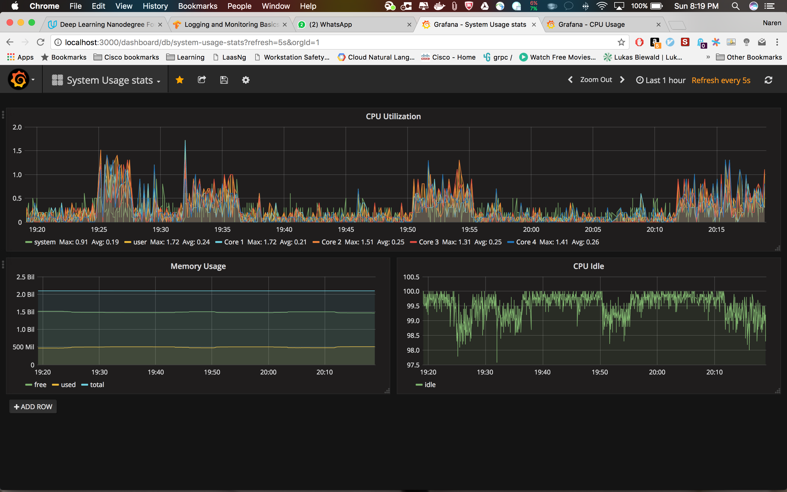

# Monitor cpu usage with influx, kapacitor and grafana

## Starting dockers

```s
$ docker-compose up -d
```

docker-compose builds the entire Grafana and Influx stack.

The Grafana Dashboard is now accessible via: http://Host-IP-Address>:3000 for example `http://localhost:3000`

For [grafana](https://github.com/grafana/grafana-docker) user name and password are admin/admin

## Sample dashboard



## Checking logs

```shell
docker logs -f influxdb
docker logs -f telegraf
docker logs -f kapacitor

```

## Creating Config file

InfluxDB

```s
docker run --rm influxdb incluxd config > influxdb.conf
```

Kapacitor

```s
docker run --rm kapacitor kapacitord config > kapacitor.conf
```

Telegraf

```s
docker run --rm telegraf -sample-config -input-filter cpu:mem -output-filter influxdb > telegraf.conf
```

## References

1.[Kapacitor geting startedguide](https://docs.influxdata.com/kapacitor/v1.2/introduction/getting_started/)

2.[Kapacitpor API Documentation](https://docs.influxdata.com/kapacitor/v1.2/api/api)

3.[Kapacitor Templating Documentation](https://docs.influxdata.com/kapacitor/v1.2/examples/template_tasks/)
